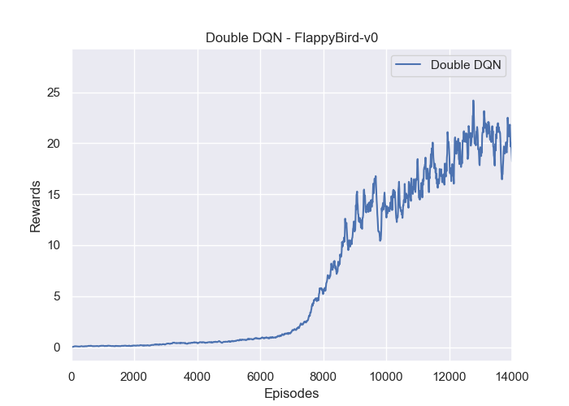

# Double Deep Q-Learning Network(Double-DQN)
This is a pytorch implementation of ["Deep Reinforcement Learning with Double Q-learning"](https://arxiv.org/abs/1509.06461). In this project, the `FlappyBird-v0` was choosen as the training environment. So, it's very cool to try it!

## Requirements
- python-3.5.2
- openai-gym
- [gym_ple](https://github.com/lusob/gym-ple)
- pytorch-0.4.0
- opencv-python

## Instruction to run the code
### Train the Network:
```bash
python train_network.py --cuda (if you have a GPU, you can use this flag)

```

### Test the Network:
```bash
python demo.py

```
### Download the Pre-trained Model
Please download them from the [Google Driver](https://drive.google.com/open?id=1ZXqRKwGI7purOm0CJtIVFXOZnmxqvA0p), then put the `saved_models` under the current folder.

## Results
### Training Performance
Although from the training plot, it could just pass about 30 pipes. However, it could have impressive performance in demo!

### Demo: Flappy-Bird


