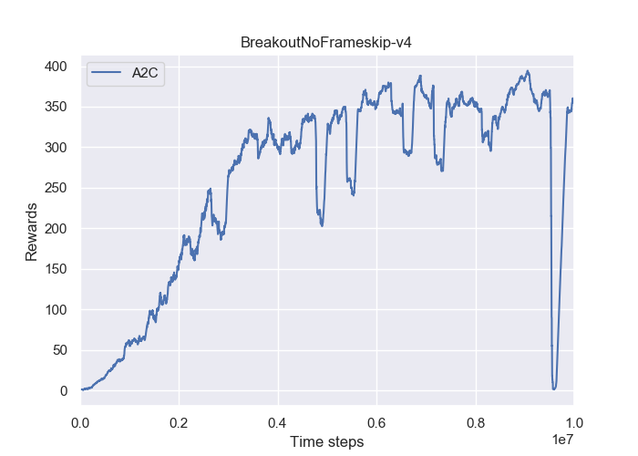

# Synchronous Advantage Actor-Critic (A2C)
This is the pytorch version of the [A2C](https://arxiv.org/pdf/1602.01783.pdf) - **which is basiclly the same as the openai baselines** 
## Requirements
- python-3.5.2
- openai baselines
- pytorch-0.4.0
## Installation
Install OpenAI Baselines
```bash
# clone the openai baselines
git clone https://github.com/openai/baselines.git
cd baselines
pip install -e .

```
## Instruction to run the code
### Train the Network:
```bash
python train_network.py --env-name 'BreakoutNoFrameskip-v4' --cuda (if you have a GPU, you can add this flag)

```
### Test the Network:
```bash
python demo.py --env-name 'BreakoutNoFrameskip-v4'

```
### Download the Pre-trained Model
Please download them from the [Google Driver](https://drive.google.com/open?id=1ZXqRKwGI7purOm0CJtIVFXOZnmxqvA0p), then put the `saved_models` under the current folder.

## Results
### Training Performance

## Demo: BreakoutNoFrameskip-v4


