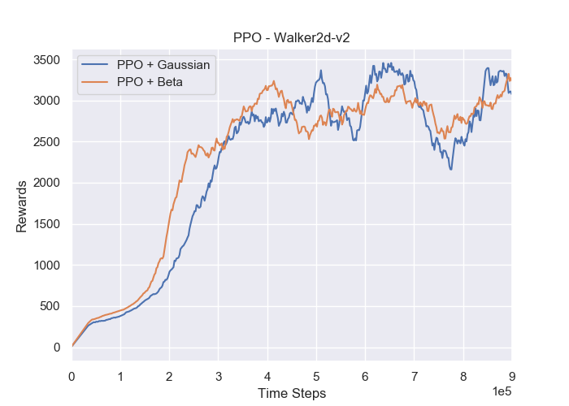
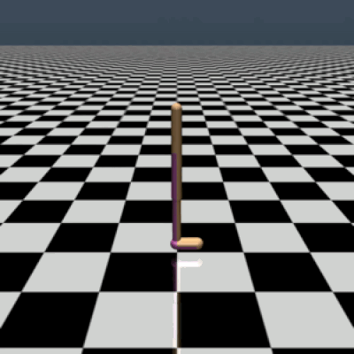

# Proximal Policy Optimization
This is a pytorch-version implementation of [Proximal Policy Optimisation(PPO)](https://arxiv.org/abs/1707.06347). In this code, the actions can also be sampled from the beta distribution which could improve the performance. The paper about this is: [The Beta Policy for Continuous Control Reinforcement Learning](https://www.ri.cmu.edu/wp-content/uploads/2017/06/thesis-Chou.pdf)

## Requirements
- python 3.5.2
- openai-gym
- mujoco-1.50.1.56
- pytorch-0.4.0

## Instruction to run the code
the `--dist` contains `gauss` and `beta`. 
### Train the Network:
```bash
python train_network.py --cuda --dist=<the type of distribution> (if you have a GPU, you can add this flag)

```
### Test the Network
```bash
python demo.py --dist=<the type of distribution>

```
### Download the Pre-trained Model
Please download them from the [Google Driver](https://drive.google.com/open?id=1ZXqRKwGI7purOm0CJtIVFXOZnmxqvA0p), then put the `saved_models` under the current folder.

## Results
### Training Performance

### Demo: Walker2d-v1
**Note:** the new-version openai-gym has problem in rendering, so I use the demo of `Walker2d-v1`



